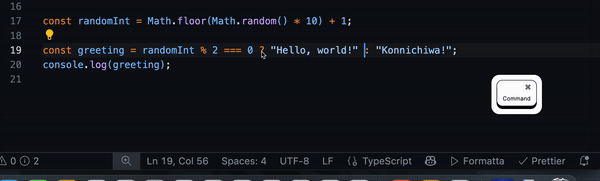

# Formatta

"Hold on" to your formatting — just 待った!✋

Formatta adds a convenient button to your status bar, letting you enable or disable format-on-save with a single click. Perfect for users who want fast, visual control over their editor’s formatting behavior.

## Requirements

- **Supported OS:** macOS only
- The extension includes a CLI binary built for macOS. Other platforms are not currently supported.

## Install

1. Go to [the VS Code Marketplace](https://marketplace.visualstudio.com/items?itemName=BeerShigachi.formatta).
2. Click on the "Install" button.

## Usage

- After installation, you'll see a Formatta button in the VS Code status bar.
- Click the button to toggle format-on-save on or off.
- The icon and tooltip will update to show the current formatting status.
- You can also use the command palette: search for "Toggle Format On Save".
